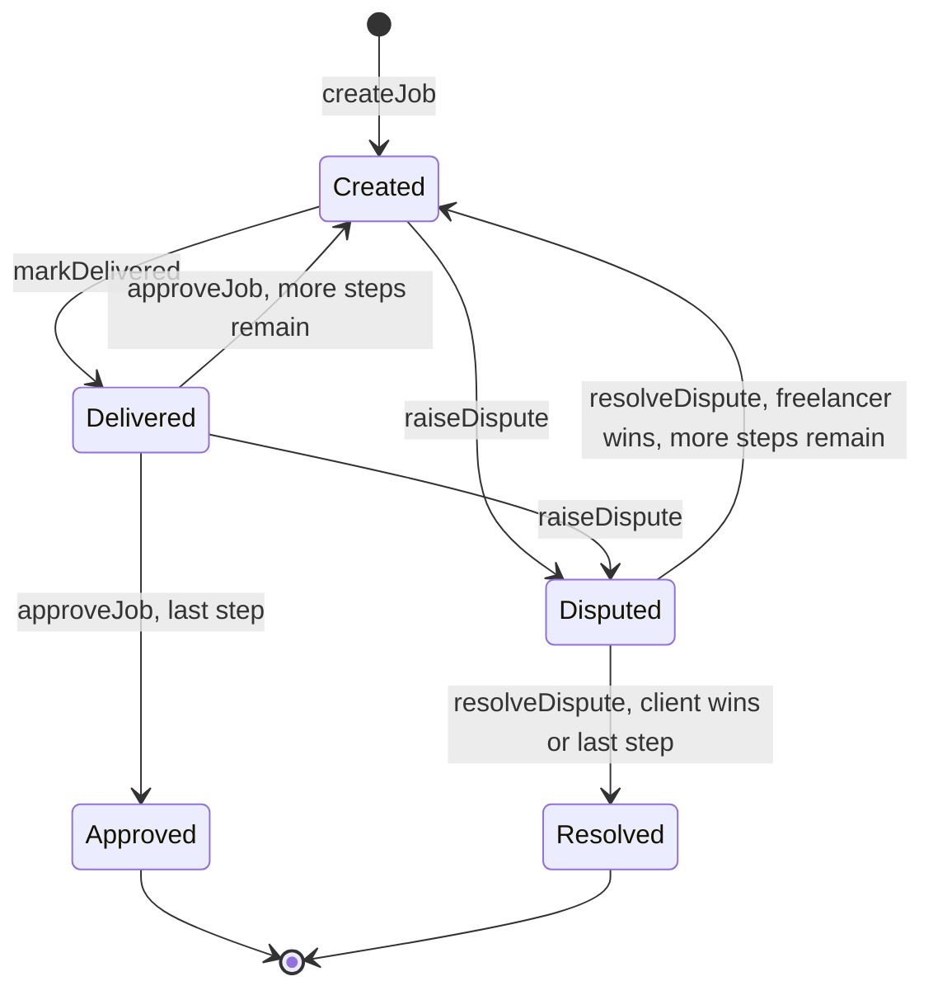

# Freelance Escrow: Whitepaper

**Author:** Innocent Taylor (Figadstro)
**Version:** 1.0 | **Network:** Sepolia testnet | **License:** MIT

## 1. Abstract

Freelance Escrow is a smart contract that holds a client's payment until the work is approved. The client locks the full payment in ETH when creating a job and divides it into one or more payment steps. The freelancer delivers one step at a time, and each approval releases only that step's share. When the parties disagree, a neutral arbiter, chosen at creation, decides the current step. The contract is small, has no owner or admin, cannot be upgraded, and holds no funds except those clients have locked for open jobs.

## 2. Problem and design goals

**The problem.** A client fears paying for work that never arrives. A freelancer fears delivering work that is never paid. Each needs a neutral holder of the money.

**Goals**

1. Funds are locked upfront and leave the contract only through the client's approval or the arbiter's decision.
2. The design follows the Option 8 brief exactly: a job with a description and locked payment, delivery by the freelancer, approval by the client, and a dispute path decided by a neutral third address.
3. The stretch goal, partial payments, is built into the core. A simple job is a job with one payment step.
4. The code is small and readable, with no external libraries, no owner, and no admin keys.
5. Every rule is covered by a test.

**Non-goals.** ERC-20 payments, cancellation, deadlines, fees, any-order milestones, and a user interface.

## 3. System overview

**Roles.** The client, the freelancer, and the arbiter must be three different non-zero addresses.

| Role | Responsibility |
|---|---|
| Client | Creates and funds the job, approves delivered steps |
| Freelancer | Delivers each step and receives payment |
| Arbiter | Decides disputes, and nothing else |

**Lifecycle.** The job's status always describes the step currently in progress.

## 4. Data model

**Status**

| Value | Meaning |
|---|---|
| `Created` | Waiting for the freelancer to deliver the current step |
| `Delivered` | Waiting for the client to approve the current step |
| `Disputed` | Frozen until the arbiter decides |
| `Approved` | Finished: every step approved and paid |
| `Resolved` | Finished: closed by the arbiter's decision |

**Job**

| Field | Type | Purpose |
|---|---|---|
| `client` | address | Funds the job, approves steps |
| `freelancer` | address | Delivers steps, receives payment |
| `arbiter` | address | Decides disputes |
| `description` | string | What the job is |
| `totalAmount` | uint256 | ETH locked at creation |
| `paidAmount` | uint256 | ETH already paid out |
| `milestoneAmounts` | uint256[] | The payment steps, in order |
| `currentMilestone` | uint256 | Index of the step in progress |
| `status` | Status | The job's status |

**Storage and constants.** `jobCount` counts jobs and doubles as the latest job ID. `jobs` maps each ID to its Job. `MAX_MILESTONES` is 20. A private flag implements the reentrancy lock. Job IDs start at 1.

## 5. Function reference

**`createJob(freelancer, arbiter, description, amounts)`** (payable)
- Caller: anyone, who becomes the client.
- Requires: ETH sent above zero; freelancer and arbiter non-zero and different from each other and from the caller; between 1 and 20 amounts; no amount of zero; amounts that sum exactly to the ETH sent.
- Effects: creates the job with status `Created`, `paidAmount` 0 and `currentMilestone` 0. Emits `JobCreated`.
- Errors: `ZeroPayment`, `InvalidAddress`, `NoMilestones`, `TooManyMilestones`, `ZeroMilestoneAmount`, `AmountMismatch`.

**`markDelivered(jobId)`**
- Caller: the freelancer. Requires status `Created`.
- Effects: status becomes `Delivered`. Emits `JobDelivered`.
- Errors: `JobNotFound`, `NotFreelancer`, `InvalidStatus`.

**`approveJob(jobId)`**
- Caller: the client. Requires status `Delivered`.
- Effects: records the payment, then pays the freelancer the current step. If it was the last step the status becomes `Approved`. Otherwise the next step becomes current and the status returns to `Created`. Emits `JobApproved`.
- Errors: `Reentrancy`, `JobNotFound`, `NotClient`, `InvalidStatus`, `TransferFailed`.

**`raiseDispute(jobId)`**
- Caller: the client or the freelancer. Requires status `Created` or `Delivered`.
- Effects: status becomes `Disputed`, and funds stay frozen. Emits `JobDisputed`.
- Errors: `JobNotFound`, `NotParty`, `InvalidStatus`.

**`resolveDispute(jobId, payFreelancer)`**
- Caller: the arbiter. Requires status `Disputed`.
- Effects: see section 6. Emits `JobResolved`.
- Errors: `Reentrancy`, `JobNotFound`, `NotArbiter`, `InvalidStatus`, `TransferFailed`.

**`getMilestones(jobId)`** (view)
- Returns the job's payment steps. It exists because Solidity's automatic getter for `jobs` omits arrays.

## 6. Payment logic

Steps are paid in order, one at a time.

| Event | Payment | Status afterwards |
|---|---|---|
| Client approves a step, more remain | That step to the freelancer | `Created`, next step current |
| Client approves the last step | That step to the freelancer | `Approved` |
| Arbiter sides with the freelancer, more steps remain | Current step to the freelancer | `Created`, next step current |
| Arbiter sides with the freelancer on the last step | Current step to the freelancer | `Resolved` |
| Arbiter sides with the client | Everything not yet paid to the client | `Resolved` |

**Invariants**

- A job can never pay out more than its `totalAmount`. Steps are paid once each, in order, and a client refund pays only `totalAmount` minus `paidAmount`.
- One job's funds can never be spent on another job, because every payout is computed from that job's own totals.
- The contract has no function that lets anyone withdraw other people's funds, and it has no owner.

## 7. Security analysis

**Access control.** Modifiers (`jobExists`, `onlyClient`, `onlyFreelancer`, `onlyArbiter`, `inStatus`) gate every state-changing function. The caller and status are checked before anything changes.

**Reentrancy.** `approveJob` and `resolveDispute`, the only functions that send ETH, carry a `nonReentrant` lock. A test uses a malicious freelancer contract that tries to re-enter during payment and confirms the attempt is rejected.

**Update first, pay second.** Before any ETH leaves, the contract records the payment and sets the new status. This blocks double payment even without the lock.

**Single payout path.** All payments go through one private function, `_pay`, which reverts on failure, so a failed transfer cannot leave the job half-updated.

**Input validation.** `createJob` rejects zero payments, zero or duplicate addresses, empty or oversized step lists, zero-value steps, and sums that do not match the ETH sent.

**Arithmetic and gas.** Solidity 0.8 checks arithmetic automatically. The only loop is bounded at 20 iterations.

**Trust assumptions**

- The arbiter is fully trusted, and there is no mechanism to replace or time out an arbiter. If the arbiter never decides, a disputed job stays frozen.
- Either the client or the freelancer can freeze an open job by raising a dispute.
- Addresses that cannot receive ETH can block their own payments. A freelancer address that rejects ETH stops `approveJob` from succeeding. A client address that rejects ETH stops a refund.
- The contract has no function for receiving plain ETH. ETH can still be force-sent to it by other means, such as a self-destructing contract. Such ETH is not tied to any job and cannot be recovered.
- Job terms are set by the client at creation, including the payment steps and the arbiter. The freelancer's agreement happens off-chain, so a freelancer should confirm a job's steps and arbiter on-chain (`jobs(jobId)` and `getMilestones(jobId)`) before starting work.

**Static analysis notes.** Foundry's linter reports four warnings, each reviewed and accepted:

- *reentrancy-eth* and *arbitrary-send-eth* on `_pay`: every escrow must send ETH to someone. Here the recipient is fixed at creation, only authorized callers trigger payment, state is updated first, and the lock is held.
- *uninitialized-local* on the running sum: Solidity zero-initializes it.
- *require-revert-in-loop*: rejecting a zero-value step inside the loop is intended.

**Audit status.** The contract has been tested but not professionally audited.

## 8. Testing

24 tests, all passing.

| Group | Count | What it proves |
|---|---|---|
| Creation | 2 | A simple job and a milestone job lock the correct amount and store their steps |
| Payment | 2 | A simple job pays in full, and a milestone job pays step by step with the contract holding the remaining balance |
| Disputes | 5 | Both outcomes for a simple job, a freelancer win mid-job after which the work continues, a client win that refunds only the unpaid balance, and only the arbiter can decide |
| Attack | 1 | A reentrancy attack is blocked |
| Rejections | 14 | Zero payment, bad addresses, empty, oversized and zero-value step lists, mismatched sums, wrong callers, wrong order, double approval, disputes after completion, and a job that does not exist |

Run them with `forge test`.

## 9. Deployment and verification

| | |
|---|---|
| Network | Sepolia testnet (chain ID 11155111) |
| Contract | `0xfE7E2b649B4D76bea09F9F7990A3C7FE43A5Aee3` |
| Transaction | `0x4990ad72a349a023185c49dac8269838da010b9e3d8ad61eee822881cf35846a` |
| Block | 11842182 |
| Gas used | 1,806,322 (about 0.00199 test ETH) |
| Compiler | Solidity 0.8.37. Full compiler settings are on the Etherscan page. |
| Verification | Verified on Etherscan, exact match |

Both deployments listed here came from the same test-only wallet, `0x9FB65352149D91D9D70669F1E004787e9739b87B`.

**Deployment history.** An earlier prototype of the core escrow, without milestones, was deployed at `0x9cdCEd629204154071A33a2388B880f2Bab62b1a`. It is superseded and should not be used. The Git tag `v1-core` marks that code.

**Lessons learned.** The prototype was deployed before the stretch goal was built. Milestones change the shape of a job from one payment into a list of payments, so adding them meant rewriting the core and deploying again at a new address. Contracts cannot be edited after deployment, so the prototype remains on-chain. The lesson: any feature that changes the structure of the core must be designed in before deployment, and deployment comes last. The final build followed that rule: roadmap approved first, milestones built in from the first line, the full test suite passing and a rehearsal run before the single deployment.

## 10. Guide for developers extending this project

| Extension | What it changes | What to retest |
|---|---|---|
| Cancel before the first delivery | A new function and a refund path | Refund amounts, who may cancel, and status rules |
| Deadlines and auto-release | Timestamps, and a way to release or replace a silent arbiter | Every status transition with time involved |
| ERC-20 payments | `createJob` pulls tokens and `_pay` transfers them, ideally with a safe-transfer wrapper | Tokens that fail, return nothing or charge fees, plus all accounting tests |
| Arbiter fee | A fee field and a payout split | The invariant that payouts never exceed the total |
| Any-order milestones | A status per step, which replaces the single job status | Almost everything |

Add tests alongside each change, and keep the invariants in section 6 true.

## 11. Disclaimer

This project is for education and runs on a test network. It has not been professionally audited. Do not use it with real funds without an independent security review.
